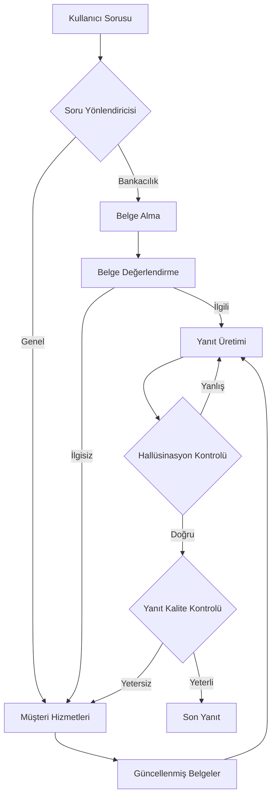

# 🏦 Advanced RAG System - VakıfBank Hackathon Project

## 🏆 Hackathon Achievement
Bu proje, **VakıfBank #HackToTheFuture 2024** hackathonunda 250'den fazla takım arasından sıyrılarak **finale kalan 14 takım** arasında yer almıştır! 48 saatlik yoğun geliştirme sürecinin sonucunda ortaya çıkan bu RAG destekli chatbot sistemi, bankacılık sektöründe yapay zeka teknolojilerinin kullanımını göstermektedir.

## 🎯 Proje Özeti
Advanced RAG (Retrieval-Augmented Generation) System, LangGraph ve OpenAI teknolojilerini kullanarak geliştirilmiş akıllı bir soru-cevap sistemidir. Sistem, bankacılık belgelerini analiz ederek kullanıcı sorularına doğru ve güvenilir yanıtlar üretir.

## ✨ Özellikler

### 🧠 Akıllı Yönlendirme
- **Otomatik Soru Sınıflandırma**: Gelen sorular bankacılık ile ilgili mi yoksa genel mi olduğunu belirler
- **Dinamik Yönlendirme**: Sorulara göre vectorstore arama veya müşteri hizmetlerine yönlendirme

### 📋 Gelişmiş RAG Pipeline
- **Belge Alma (Retrieval)**: Chroma vektör veritabanından ilgili belgelerin getirilmesi
- **Belge Değerlendirme**: Getirilen belgelerin soruyla ilgili olup olmadığının kontrolü
- **Hallüsinasyon Kontrolü**: Üretilen yanıtların belgelerle uyumlu olup olmadığının doğrulanması
- **Yanıt Kalite Kontrolü**: Yanıtların soruyu yeterli şekilde cevaplayıp cevaplayamadığının değerlendirilmesi

### 🔧 Modüler Mimari
- **LangGraph Workflow**: Graf tabanlı iş akışı yönetimi
- **Zincirli İşlemler**: Modüler ve genişletilebilir chain yapısı
- **Durum Yönetimi**: Merkezi state management sistemi

## 🏗️ Sistem Mimarisi



## 📦 Kurulum

### Gereksinimler
- Python 3.8+
- OpenAI API Key
- DOCX belgeleriniz

### Adım 1: Depoyu Klonlayın
```bash
git clone <repository-url>
cd AdvancedRagSystem
```

### Adım 2: Sanal Ortam Oluşturun
```bash
python -m venv venv
# Windows
venv\Scripts\activate
# macOS/Linux
source venv/bin/activate
```

### Adım 3: Bağımlılıkları Kurun
```bash
pip install -r requirements.txt
```

### Adım 4: Çevre Değişkenlerini Ayarlayın
`.env` dosyası oluşturun:
```env
OPENAI_API_KEY=your_openai_api_key_here
```

### Adım 5: Belgeleri Hazırlayın
`ingestion.py` dosyasında belge yolunuzu güncelleyin:
```python
doc = [
    r"path/to/your/documents.docx"
]
```

### Adım 6: Vektör Veritabanını Oluşturun
```bash
python ingestion.py
```

## 🚀 Kullanım

### Temel Çalıştırma
```bash
python main.py
```

### Örnek Kullanım
```
Sorunuzu giriniz (Çıkmak için 'q' ya basın): Kredi başvurusu nasıl yapılır?

Cevap: Kredi başvurusu için öncelikle şubemize kimlik belgeniz ve gelir belgenizle...
```

## 📁 Proje Yapısı

```
AdvancedRagSystem/
├── graph/                      # Ana graf yapısı
│   ├── chains/                 # LangChain zincirleri
│   │   ├── answer_grader.py    # Yanıt kalite değerlendirici
│   │   ├── generation.py       # Yanıt üretici
│   │   ├── hallucination_grader.py # Hallüsinasyon kontrolü
│   │   ├── retrieval_grader.py # Belge relevans değerlendirici
│   │   └── router.py          # Soru yönlendirici
│   ├── nodes/                 # Graf düğümleri
│   │   ├── customer_service.py # Müşteri hizmetleri
│   │   ├── generate.py        # Yanıt üretimi
│   │   ├── grade_documents.py # Belge değerlendirme
│   │   ├── retrieve.py        # Belge alma
│   │   └── web_search.py      # Web arama (isteğe bağlı)
│   ├── graph.py              # Ana graf tanımı
│   ├── node_constants.py     # Düğüm sabitleri
│   └── state.py              # Durum yönetimi
├── ingestion.py              # Belge işleme ve vektörleştirme
├── main.py                   # Ana uygulama
└── requirements.txt          # Python bağımlılıkları
```

## 🔧 Teknik Detaylar

### Kullanılan Teknolojiler
- **LangChain**: LLM uygulamaları için framework
- **LangGraph**: Graf tabanlı iş akışı yönetimi
- **OpenAI GPT**: Dil modeli
- **Chroma**: Vektör veritabanı
- **Embeddings**: OpenAI text-embedding-ada-002

### Veri İşleme
- **Belge Formatı**: DOCX dosyaları
- **Metin Bölme**: RecursiveCharacterTextSplitter (1000 karakter, 100 overlap)
- **Vektörleştirme**: OpenAI Embeddings
- **Depolama**: Chroma vektör veritabanı

### Kalite Kontrol Mekanizmaları
1. **Belge Relevans Kontrolü**: Getirilen belgelerin soruyla ilgili olup olmadığını kontrol eder
2. **Hallüsinasyon Kontrolü**: Üretilen yanıtların kaynak belgelerle tutarlı olup olmadığını doğrular
3. **Yanıt Kalite Kontrolü**: Yanıtların soruyu yeterli şekilde cevaplayıp cevaplayamadığını değerlendirir

## 🎓 Öğrenilen Dersler

Bu hackathon süreci boyunca:
- **İnovasyon**: Yapay zeka teknolojilerinin bankacılık sektöründeki potansiyeli
- **Zaman Yönetimi**: 48 saatlik sıkışık programda verimli çalışma
- **Ekip Çalışması**: Multidisipliner ekip koordinasyonu
- **Problem Çözme**: Gerçek dünya problemlerine teknoloji tabanlı çözümler

## 👥 Takım

- **Hasan**: Proje lideri ve geliştirici
- **Fuat Yavaş**: Geliştirici
- **İsmail Şahin**: Geliştirici

## 🙏 Teşekkürler

Bu projenin başarısında emeği geçen herkese teşekkürlerimizi sunarız:

### Jüri Üyeleri
- **Metin Recep ZAFER** - VakıfBank Genel Müdür Yardımcısı
- **Ferkan MERDAN** - VakıfBank Genel Müdür Yardımcısı
- **Timur SIRT** - Gazeteci
- **Prof. Dr. Sahin Albayrak**
- **Prof. Dr. Özer KÖSEOĞLU**

### Mentörler
- **Furkan Keskiner** - Ana Mentör
- **Mehmet Serhat Keskin**
- **Suha Erdem Yabas**
- **Beyza Oksar**

### Organizasyon
- **İlter Haliloglu** ve ekibi - VakıfBank #HackToTheFuture 2024 organizasyonu

## 📝 Lisans

Bu proje MIT lisansı altında lisanslanmıştır. Detaylar için LICENSE dosyasına bakınız.

## 🔮 Gelecek Geliştirmeler

- [ ] Web arayüzü eklenmesi
- [ ] Çoklu dil desteği
- [ ] Sesli sorgu desteği
- [ ] Mobil uygulama entegrasyonu
- [ ] Daha gelişmiş belge formatları desteği
- [ ] Real-time öğrenme mekanizması

---

**VakıfBank #HackToTheFuture 2024** - Yapay zekanın gücüyle bankacılığın geleceğini şekillendiriyoruz! 🚀